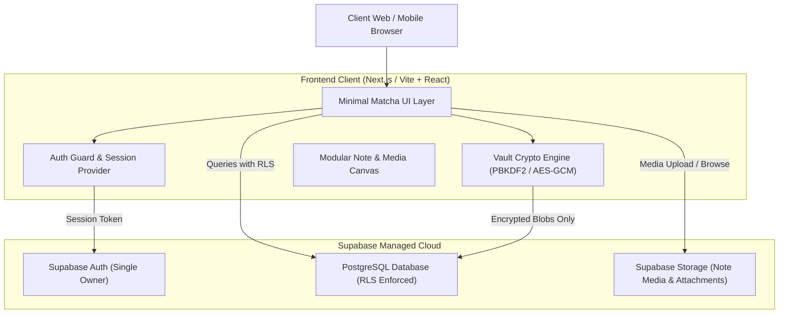

# System Architecture & Technical Specifications

## 1. System Overview



---

## 2. Security Architecture

### 2.1 Single-Tenant Authentication
- **Access Policy**: Only pre-authorized user credentials can establish a session.
- **Registration**: Public user signups are explicitly disabled (`enable_signup = false` in Supabase Auth configuration).
- **Session Handling**: Secure HTTP-only cookies and auto-refreshing JWTs.

### 2.2 Dual-Layer Vault Security (6-Digit PIN Gate)
For accounts, passwords, recovery phrases, and API credentials:
1. **Zero-Knowledge / High-Entropy Derivation**:
   - The user defines a 6-digit numeric PIN on first setup.
   - When entered, the PIN is combined with a unique user salt using `PBKDF2` (or WebCrypto `HKDF`/`AES-GCM-256`) to derive a symmetric encryption key strictly in memory.
   - Credentials stored in the `vault_items` table are saved as encrypted ciphertext + initialization vector (`iv`).
   - The raw PIN is **never stored** in the database.
2. **Session Auto-Locking**:
   - Vault memory state clears automatically after 3 minutes of idle time or upon tab visibility changes (`visibilitychange` event).
   - Failed PIN attempts trigger exponential rate limiting.

---

## 3. Database Schema & RLS Policies

### 3.1 Tables

#### `notes`
| Column | Type | Description |
| :--- | :--- | :--- |
| `id` | `uuid` (PK) | Primary Key (gen_random_uuid()) |
| `user_id` | `uuid` (FK) | Reference to `auth.users.id` |
| `title` | `text` | Note headline / title |
| `content` | `jsonb` or `text` | Note content (blocks / markdown) |
| `category` | `text` | General, To-Do, Idea, Scratchpad |
| `is_pinned` | `boolean` | Pinned to top of view |
| `tags` | `text[]` | Array of organizing tags |
| `created_at` | `timestamptz` | Creation timestamp |
| `updated_at` | `timestamptz` | Last updated timestamp |

#### `note_attachments`
| Column | Type | Description |
| :--- | :--- | :--- |
| `id` | `uuid` (PK) | Attachment identifier |
| `note_id` | `uuid` (FK) | Reference to `notes.id` (ON DELETE CASCADE) |
| `user_id` | `uuid` (FK) | Reference to `auth.users.id` |
| `storage_path`| `text` | Path inside Supabase Storage bucket |
| `mime_type` | `text` | image/jpeg, image/png, image/webp |
| `size_bytes` | `integer` | File size |
| `created_at` | `timestamptz` | Upload timestamp |

#### `vault_items`
| Column | Type | Description |
| :--- | :--- | :--- |
| `id` | `uuid` (PK) | Vault entry ID |
| `user_id` | `uuid` (FK) | Reference to `auth.users.id` |
| `title` | `text` | Display label (e.g. "Github Account") |
| `category` | `text` | Account, Password, Secure Note, Card |
| `encrypted_payload` | `text` | AES-GCM encrypted ciphertext (base64) |
| `iv` | `text` | Initialization vector (base64) |
| `created_at` | `timestamptz` | Creation timestamp |
| `updated_at` | `timestamptz` | Last modification |

#### `vault_config`
| Column | Type | Description |
| :--- | :--- | :--- |
| `user_id` | `uuid` (PK) | FK to `auth.users.id` |
| `salt` | `text` | Cryptographic salt for PBKDF2 |
| `verifier_hash` | `text` | Hash verifier to validate correct PIN entry |
| `created_at` | `timestamptz` | Creation timestamp |

### 3.2 Row Level Security (RLS)
Every table has RLS explicitly enabled:
```sql
ALTER TABLE notes ENABLE ROW LEVEL SECURITY;
CREATE POLICY "Owner note access only" ON notes
    FOR ALL
    USING (auth.uid() = user_id)
    WITH CHECK (auth.uid() = user_id);
```

---

## 4. UI Design System & Ergonomics

### 4.1 Palette Tokens
- **Background Root**: `#FBFBF9` (Warm Ceramic Off-White)
- **Subtle Surface / Cards**: `#F4F3EE` (Light Clay Cream)
- **Deep Matcha Accent**: `#2D4739` (Ceremonial Forest Matcha)
- **Vibrant Matcha**: `#4E6E58` (Muted Herb Green)
- **Matcha Wash**: `#E8EFE8` (High-contrast soft selection & badges)
- **Primary Text**: `#1A211D` (Deep Charcoal Spruce)
- **Secondary Text**: `#5C6861` (Earthy Slate)
- **Borders & Dividers**: `#E4E3DC` (Whisper Hairline Border)

### 4.2 Responsive Layout
- **Desktop (>= 1024px)**:
  - Collapsible slim rail navigation (Notes, To-Dos, Media, Vault).
  - List column with instant search & tag filter.
  - Generous distraction-free reading/editing pane.
- **Mobile (< 1024px)**:
  - Fixed bottom navigation bar with 4-5 tap destinations.
  - Floating Action Button (FAB) or top-right subtle `+` button for rapid capture.
  - Full-screen distraction-free editor with native swipe-back gestures.
